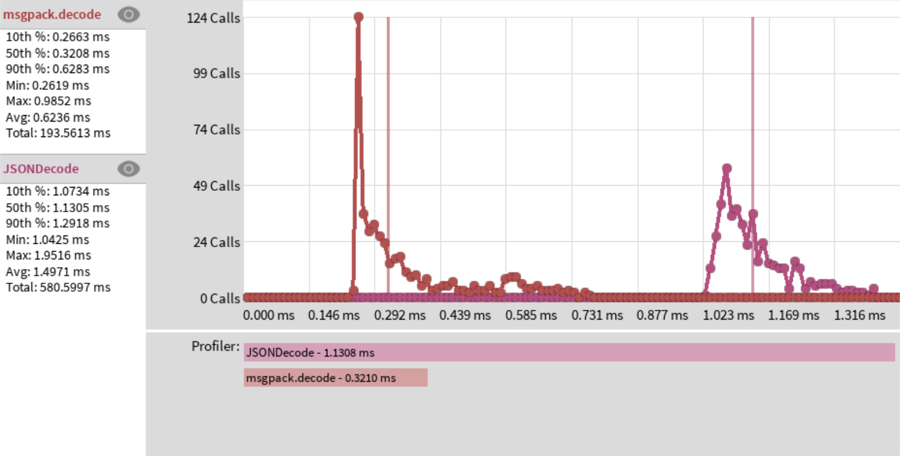

# MessagePack for Luau

A pure MessagePack binary serialization format implementation in Luau.

# Goals

* Fulfill as much of MessagePack specification, as Luau allows
* Be on par with HttpService's `JSONEncode` and `JSONDecode` performance wise
* Keep code readable as long as it does not get in the way of prior goals

## Usage

Decoding:
```lua
local msgpack = require(path.to.msgpack)
local message = "\x92\xA5hello\xA5world"

print(msgpack.decode(message))
```

## Performance

One of the project goals is to match or exceed the performance of Roblox offered data serialization and deserialization methods (HttpService's `JSONEncode` and `JSONDecode`).
To ensure fulfilment of this goal the module's methods need to be benchmarked.

To benchmark message decoding performance an approximately 210KB large JSON encoded payload has been chosen.
This JSON is then used as input for `HttpService:JSONEncode()` method and also encoded in MessagePack format so that it can be used as input for `msgpack.decode()` function.
For MessagePack encoding [an online msgpack-lite encoder](https://kawanet.github.io/msgpack-lite/) was used.

As visible in the [boatbomber's benchmarker plugin](https://devforum.roblox.com/t/benchmarker-plugin-compare-function-speeds-with-graphs-percentiles-and-more/829912) results, `msgpack.decode` considerably exceeds `JSONDecode` performance:


For more details on the benchmark setup, look into `./benchmark` directory.
To construct the benchmarking place, the following shell command was used: `rojo build -o benchmark.rbxl benchmark.project.json`

## State of project

- [ ] Decoding
  - [x] Nil
    - [ ] Unit test
  - [x] Boolean
    - [ ] Unit test
  - [x] Int
    - [ ] Unit test
  - [x] Float
    - [ ] Unit test
  - [x] String
    - [ ] Unit test
  - [x] ByteArray (binary data)
    - [ ] Unit test
  - [x] Array
    - [ ] Unit test
  - [x] Map (dictionary)
    - [ ] Unit test
  - [x] Extension
    - [ ] Unit test
  - [ ] Timestamp extension
    - [ ] Unit test
- [ ] Encoding
  - [ ] Nil
    - [ ] Unit test
  - [ ] Boolean
    - [ ] Unit test
  - [ ] Int
    - [ ] Unit test
  - [ ] Float
    - [ ] Unit test
  - [ ] String
    - [ ] Unit test
  - [ ] ByteArray (binary data)
    - [ ] Unit test
  - [ ] Array
    - [ ] Unit test
  - [ ] Map (dictionary)
    - [ ] Unit test
  - [ ] Extension
    - [ ] Unit test
  - [ ] Timestamp extension
    - [ ] Unit test
